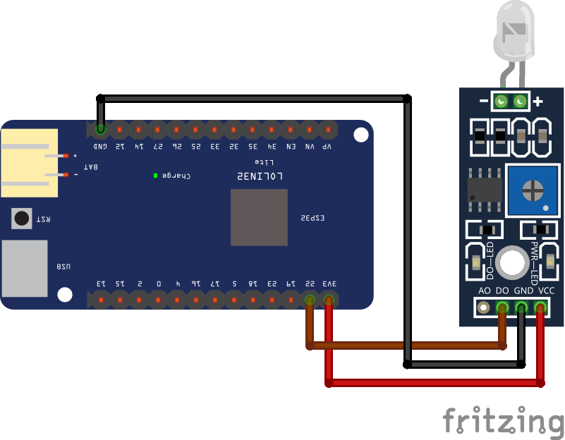

 ## Conexión del Fotodiodo (Total Disolved Solids) a ESPHome

Ejemplo de conexión de un fotodiodo una placa Lolin32 (ESP32).

Vídeo tutorial en [Youtube](https://youtu.be/-ZPVcZquZpc)

Descarga del [esquema](esquema.fzz) para usarlo con el software de edición [fritzing](https://fritzing.org/)
