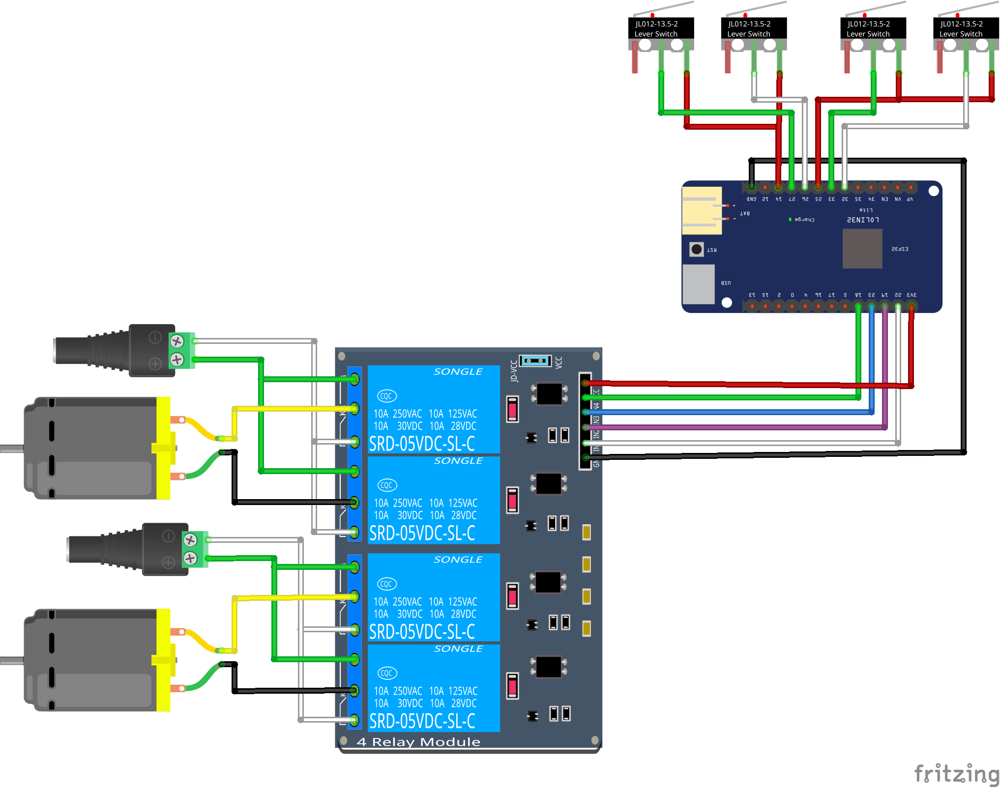

## Domotiza Sofá con EspHome y Home Assistant

Circuito de conexión de un sofá motorizado a EspHome.

Vídeo tutorial en [Youtube](https://youtu.be/RoVCvHmFbas)

Descarga del [esquema](esquema.fzz) para usarlo con el software de edición [fritzing](https://fritzing.org/)
