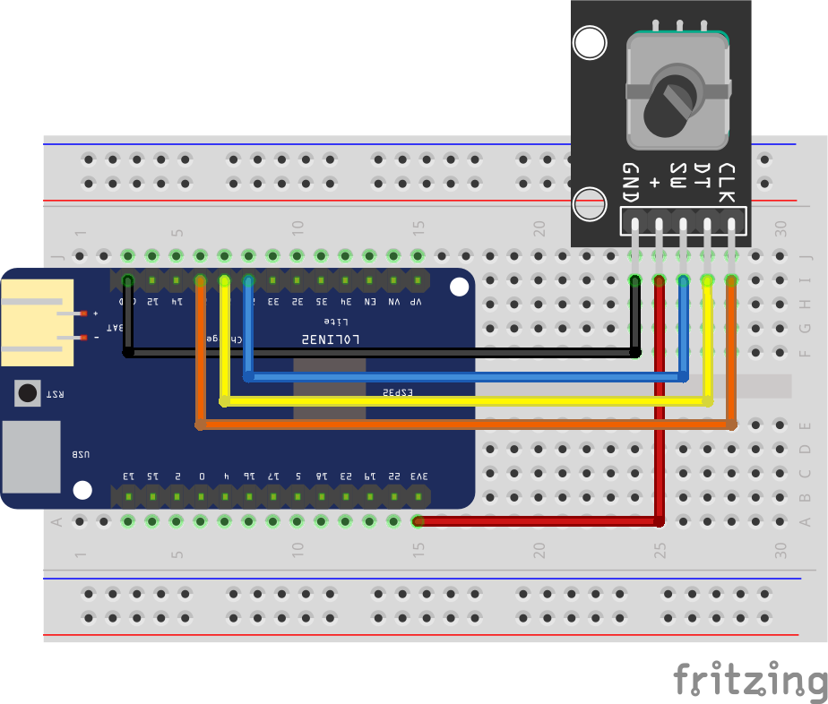

## Esquema de Encoder con ESPHome

Conexión para usar un encoder con pulsador en ESPHome

Vídeo tutorial en [Youtube](https://youtu.be/v18CMw6Tfx0)

Descarga del [esquema](esquema.fzz) para usarlo con el software de edición [fritzing](https://fritzing.org/)
