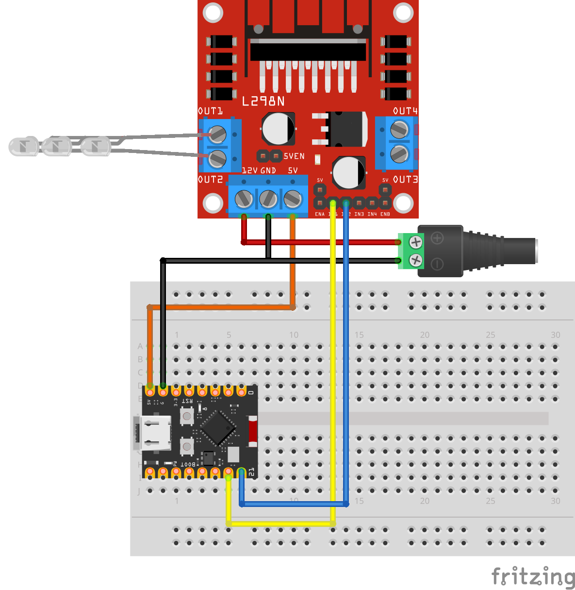

## Control de Luces de Navidad mediante Puente H con ESPHome

Circuito de conexión de luces de Navidad con un Puente H y EspHome

Vídeo tutorial en [Youtube](https://youtu.be/q-FuJQuTSOA)

Descarga del [esquema](esquema.fzz) para usarlo con el software de edición [fritzing](https://fritzing.org/)
