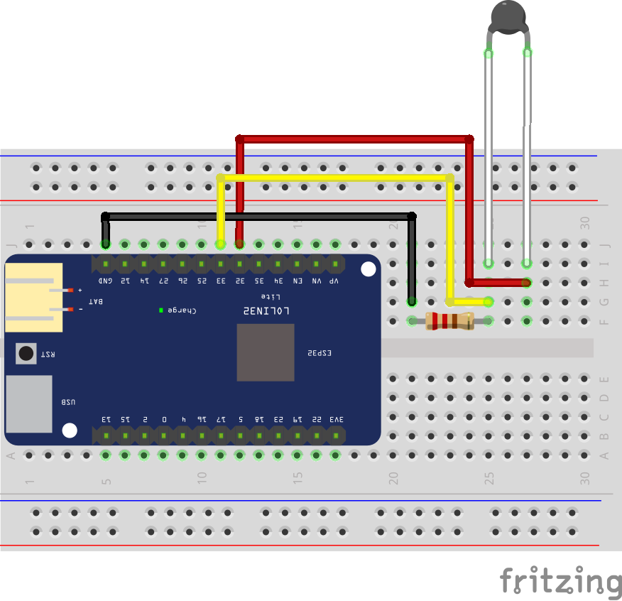

## Lectura de sonda de temperatura NTC con EspHome

Conexión sobre como leer una resistencia NTC con EspHome

Vídeo tutorial en [Youtube](https://youtu.be/xl6d8-L8c2c)

Descarga del [esquema](esquema.fzz) para usarlo con el software de edición [fritzing](https://fritzing.org/)
