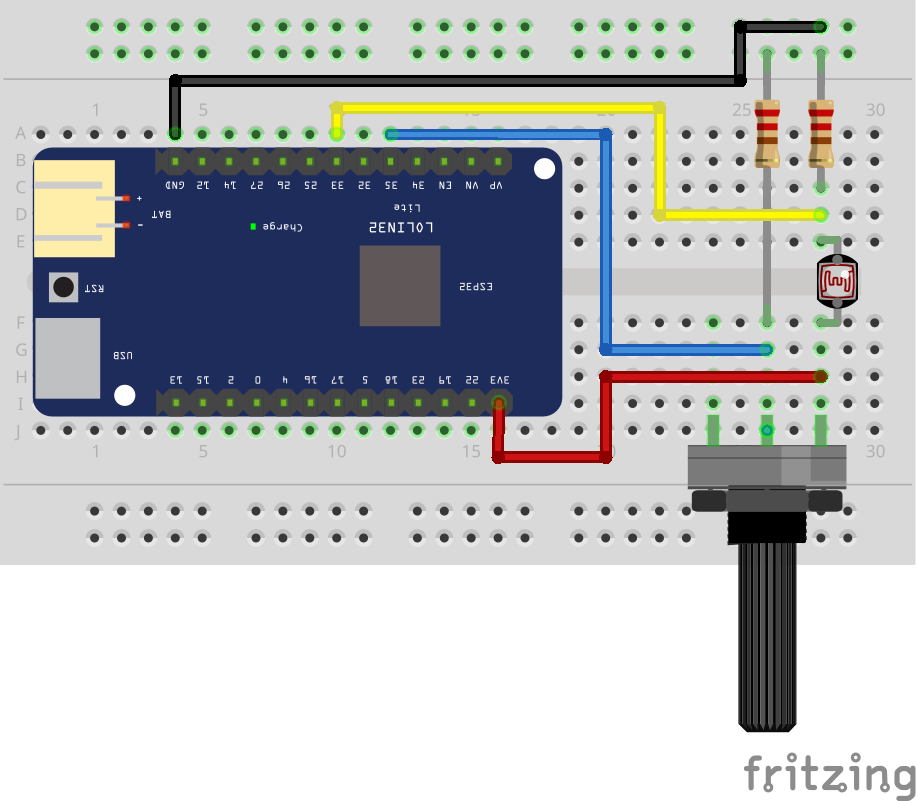

## Lectura de resistencias y divisor de tensión

Circuito de conexión de un divisor de tensión para leer un LDR y un potenciómetro en EspHome.

Vídeo tutorial en [Youtube](https://youtu.be/0kFXpzTSmJA)

Descarga del [esquema](esquema.fzz) para usarlo con el software de edición [fritzing](https://fritzing.org/)
