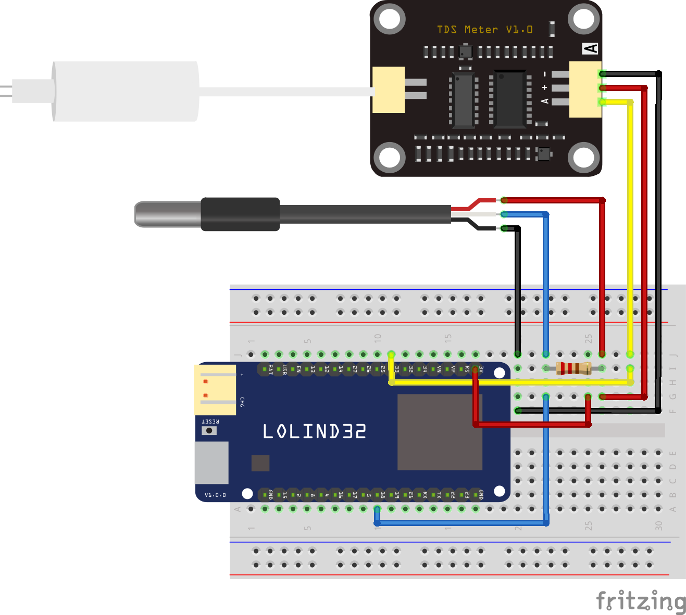

 ## Conexión del Sensor TDS (Total Disolved Solids) a ESPHome

Ejemplo de conexión de un sensor TDS y una sonda de temperatura DS18B20 a una placa Lolin32 (ESP32).

Vídeo tutorial en [Youtube](https://youtu.be/bwFt1yoXWyI)

Descarga del [esquema](esquema.fzz) para usarlo con el software de edición [fritzing](https://fritzing.org/)
