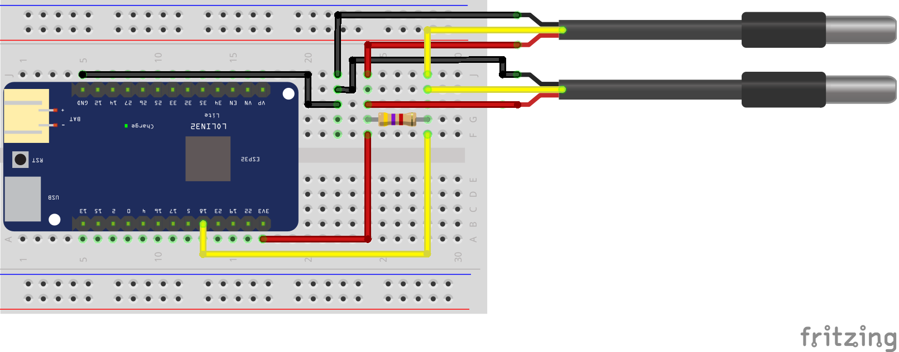

 ## Conexión del Sensor de Temperatura Dallas (DS18B20) a EspHome

Ejemplo de conexión de dos sondas de temperatura dallas a una placa Lolin32 (ESP32).

Vídeo tutorial en [Youtube](https://youtu.be/iYjCrauUGCc)

Descarga del [esquema](esquema.fzz) para usarlo con el software de edición [fritzing](https://fritzing.org/)
