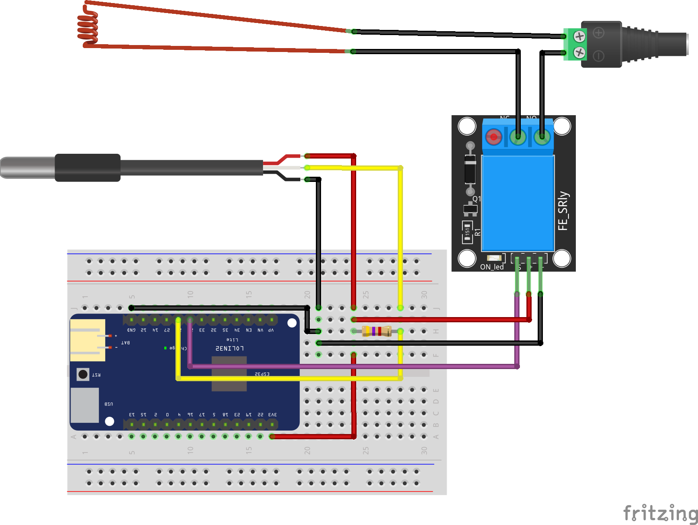

## Domotizar calentador de agua con EspHome y Home Assistant

Conexión para crear un calentador de agua con EspHome

Vídeo tutorial en [Youtube](https://youtu.be/CTa2iX8ZCRA)

Descarga del [esquema](esquema.fzz) para usarlo con el software de edición [fritzing](https://fritzing.org/)
